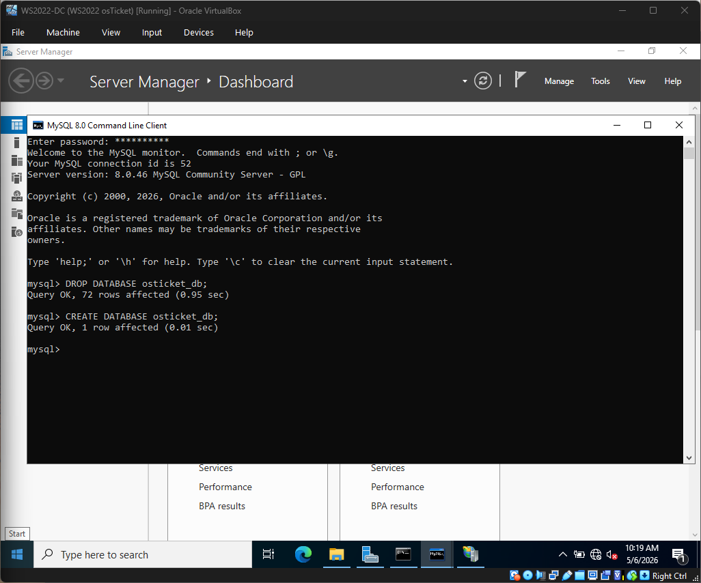
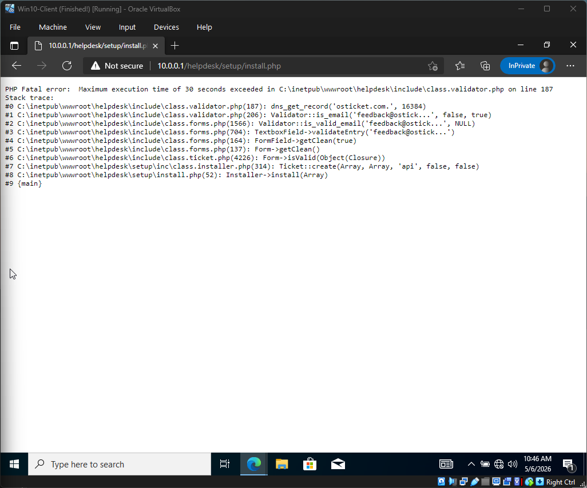

# 💻 Windows Help Desk Lab (osTicket + Active Directory)

## 🔹 Overview
Built a virtual IT help desk lab using **Windows Server 2022** and a **Windows 10 client** machine within a virtualized environment. 

Configured **Active Directory** and deployed **osTicket** to simulate a real-world help desk workflow including ticket creation, troubleshooting, escalation, resolution, and documentation. This project demonstrates hands-on understanding of enterprise IT support processes and remote troubleshooting methodology.

---

## 🔹 Environment & Lab Architecture
* **OS:** Windows Server 2022 (Domain Controller), Windows 10 Pro (Client)
* **Directory Services:** Active Directory Users & Computers (ADUC)
* **Ticketing System:** osTicket (LAMP stack on Windows via IIS)
* **Virtualization:** Oracle VirtualBox

### **Lab Infrastructure Setup**
| Storage Configuration | Guest Additions | Installation Repository |
| :--- | :--- | :--- |
|  |  |  |
| *Configuring Virtual SATA controllers.* | *Ensuring driver compatibility.* | *Pre-staging MySQL, PHP, and osTicket.* |

---

# 🎫 Help Desk Lifecycle & Ticket Scenarios
This section demonstrates the transition from a user reporting an issue to a technician resolving it.

### **1. Business Logic Configuration**
Before handling tickets, I configured the backend infrastructure to mirror an enterprise environment.
* **Departments:**  *(Configuring Support, Maintenance, and Hardware tiers)*
* **SLA Plans:**  *(Setting response time objectives: SEV-A, SEV-B, SEV-C)*
* **Agent Roles:**  *(Defining permissions for Help Desk staff)*

### **2. Ticket Scenario 1 – Adobe Licensing Issue**
* **Issue:** User reported a licensing mismatch preventing access to Creative Cloud.
* **Troubleshooting:** Verified licensing portal synchronization and reassigned seats.
* **Resolution:** 

### **3. Ticket Scenario 2 – VPN Connectivity Issue**
* **Issue:** Remote user unable to connect to the corporate gateway.
* **Troubleshooting:** Conducted DNS flush and verified gateway IP configuration.
* **Resolution:** 

### **4. Ticket Scenario 3 – Account Lockout / Password Reset**
* **Issue:** AD Account lockout after multiple failed login attempts.
* **Troubleshooting:** Reset credentials and forced password change via Admin Panel.
* **Resolution:** 

### **5. Final Resolution Summary**
* **Outcome:** Successfully resolved all pending high-priority tickets within SLA.
* **Evidence:** 

---

# 🛠️ osTicket Deployment & Infrastructure Troubleshooting
This section showcases the "Service Desk Engineering" side of the lab. Multiple infrastructure hurdles were cleared to get the environment live.

### **1. Core Installation & Database Engineering**
* **Database Setup:**  & 
* **Permissions & Security:**  &  *(Hardening the system post-installation)*
* **Installation Success:**  & 

### **2. Critical Troubleshooting: Resolving Configuration Failures**
I documented the transition from system failure to a stable environment.

* **Database Connection & Admin Issues:**  & 
* **Timeout & Performance Tuning:**  *(Modifying `php.ini` to handle script execution limits)*
* **Visualizing the "Break":**  &  *(Analyzing raw PHP logs for root cause identification)*

### **3. Documented Errors & Resolutions**
* **HTTP 500 & General Failures:**  & 
* **Specific Resolution:** 
* **Final Deployment Success:** 

---

## 🔹 Skills Demonstrated
* **AD Management:** User provisioning and account recovery.
* **Technical Troubleshooting:** IIS Module mapping, PHP extension configuration, and MySQL administration.
* **System Optimization:** Performance tuning via `php.ini` and execution time adjustments.
* **Help Desk Operations:** SLA management, department triaging, and ticket lifecycle documentation.

---

## 🚀 Future Improvements
* Integrate Azure AD for hybrid identity management simulations.
* Automate user onboarding via PowerShell scripts.
* Implement Group Policy Objects (GPO) to manage client machine restrictions.
